<picture>
  <source media="(prefers-color-scheme: dark)" srcset="assets/hero-dark.svg">
  <source media="(prefers-color-scheme: light)" srcset="assets/hero-light.svg">
  
</picture>

 

Shipping open-source developer tools and full-stack products across the stack\.

## Flagship systems

| Repository | Role | Purpose |
| --- | --- | --- |
| [`sbti`](https://github.com/muerzy/sbti)  | SHIP | SBTI open-source edition — the flagship release\. |
| [`plico`](https://github.com/muerzy/plico)  | CREATE | Lightweight cross-platform text \+ Markdown editor (Tauri 2 · React · CodeMirror 6)\. |
| [`ztools-plugin-plain-text`](https://github.com/muerzy/ztools-plugin-plain-text)  | EXTEND | Plain-text plugin for the ztools toolkit\. |

## Closed-loop architecture

<picture>
  <source media="(prefers-color-scheme: dark)" srcset="assets/closed-loop-dark.svg">
  <source media="(prefers-color-scheme: light)" srcset="assets/closed-loop-light.svg">
  
</picture>

## 代码之外

高校计算机教师 · 全栈 / 游戏 / Web3 / AI 开发者。键盘之外，这些事把我拉回血：

<table>
  <tr>
    <td align="center" width="25%"><b>🏋️ 健身</b> 撸铁 · 街头健身 跑步 · 篮球</td>
    <td align="center" width="25%"><b>🎮 游戏</b> 3A 大作 开放世界 RPG</td>
    <td align="center" width="25%"><b>🎬 自媒体</b> 健身日常 技术分享 · 游戏娱乐</td>
    <td align="center" width="25%"><b>📚 学习</b> AI · Web3 Game · APP · 永不停歇</td>
  </tr>
</table>

<i>“用代码编织世界。”</i> ✨

<a href="https://github.com/muerzy">GitHub</a> · <a href="https://muerzy.com">Website</a> · <a href="mailto:muerzy@gmail.com">Email</a>

<!-- Generated by profile-control-plane. Edit profile.yaml, not this file. -->
